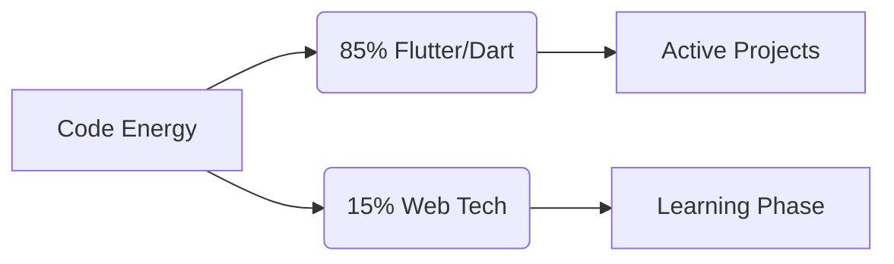

# <div align="center">🚀 Afia Raisa</div>
<div align="center">
  
**Flutter Developer • Digital Architect • Future Innovator**


</div>

---

## <div align="center">🌌 Tech Universe</div>

<div align="center">

| **Dimension** | **Technologies** |
|:-------------:|:-----------------|
| **🛰️ Mobile Realm** |    |
| **🌐 Web Nexus** |    |
| **⚡ Server Core** |   |
| **💾 Data Matrix** |   |
| **🔧 Dev Tools** |    |

</div>

---

## <div align="center">📡 Digital Footprint</div>

<div align="center">



<br/>

|  |  |
|:---:|:---:|


</div>
---

## <div align="center">📶 Code Frequency</div>

<div align="center">

```python
Dart        ██████████████████████████████ 85.2% 
JavaScript  █████████████▍                18.3% 
HTML        ███████▌                     7.5% 
CSS         █████▎                       4.1% 
Other       █                            0.9%
```

</div>

---

## <div align="center">📡 Communication Array</div>

<div align="center">

[](mailto:afia.raisa876@gmail.com)
[](https://github.com/Raisa-01)
[](https://linkedin.com/in/yourprofile)

</div>

---

<div align="center">


**"The future belongs to those who believe in the beauty of their dreams"**

</div>
